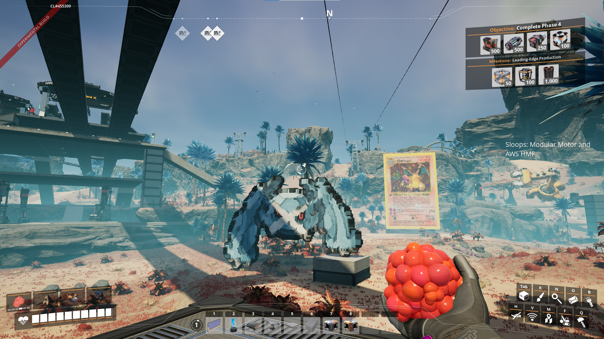

# Satisfactory Art Blueprints

CLI tools for converting images and 3D models to Satisfactory blueprint JSON files using painted beams.
The json blueprint can be converted into usable .sbp/.sbpcfg files with @etothepii/satisfactory-file-parser
Note that the entity limit for the number of beams in a blueprint before it will crash is around 10k, atleast on my computer


## Features

- **Image to Blueprint**: Convert any image to pixel art using painted beams with custom RGB colors
- **3D Model to Blueprint**: Voxelize 3D models (STL, OBJ, PLY, GLTF, etc.) into painted beam structures
- **Condensed Rendering**: Pack multiple beams per pixel using z-clipping for dramatically increased detail
- **Flexible Resolution**: Support from 16×16 pixel art to 4K (3840×2160) images
- **Custom Colors**: Pixel-perfect RGB color matching using linear color space
- **Background Filtering**: Automatic background removal for cleaner results
- **Surface Voxelization**: Efficient hollow 3D structures

## Quick Start

### Installation

```bash
# Clone the repository
git clone https://github.com/LuckCow/satisfactory-art-blueprints.git
cd satisfactory-art-blueprints

# Install dependencies
pip install -r requirements.txt
```

### Convert an Image

```bash
# full exmaple
python .\blueprint_gen.py examples\Inserter.webp -s 32x32 --condensed --cr-multiplier 3 --cr-depth-offset 0.1
npm run encode .\Inserter.json

# Simple conversion (full resolution)
python blueprint_gen.py image.png

# Downsample to specific size
python blueprint_gen.py image.png -s 64x64

# Use percentage scaling
python blueprint_gen.py image.png -s 50%

# Remove background automatically
python blueprint_gen.py image.png -s 128x128 --filter-bg auto

# Enable condensed rendering for higher detail
python blueprint_gen.py image.png -s 64x64 --condensed

# Use 3x3 multiplier for 9x more detail
python blueprint_gen.py image.png -s 64x64 --condensed --cr-multiplier 3
```

### Convert a 3D Model

```bash
# Convert with default settings (100 voxels in largest dimension)
python voxelize.py model.stl

# Higher detail (200 voxels in largest dimension)
python voxelize.py model.obj -s 200

# Lower detail (50 voxels in largest dimension)
python voxelize.py model.stl -s 50

# Custom color
python voxelize.py model.glb --color 1 0.5 0
```

## Project Structure

```
satisfactory-art-blueprints/
├── blueprint_gen.py        # CLI for image conversion
├── voxelize.py             # CLI for 3D model conversion
├── requirements.txt        # Python dependencies
├── README.md              # This file
├── lib/                   # Shared library modules
│   ├── __init__.py
│   ├── blueprint.py       # Core blueprint classes
│   ├── image_processor.py # Image conversion logic
│   └── model_voxelizer.py # 3D model voxelization
├── docs/                  # Documentation
│   └── blueprint_gen_doc.md
└── examples/              # Example blueprints
    └── CustomSwatchColorBeams.json
```

## CLI Reference

### Image Conversion (`blueprint_gen.py`)

Convert images to painted beam pixel art.

#### Basic Usage

```bash
python blueprint_gen.py <image> [options]
```

#### Options

| Option                    | Description                                        | Default         |
| ------------------------- | -------------------------------------------------- | --------------- |
| `-s, --size SIZE`         | Target resolution (WxH, "W H", or %)               | Full resolution |
| `-o, --output FILE`       | Output JSON file                                   | `<image>.json`  |
| `-n, --name NAME`         | Blueprint name                                     | Image filename  |
| `--spacing FLOAT`         | Beam spacing in cm                                 | 100.0           |
| `--base-z FLOAT`          | Base Z height in cm                                | 1200.0          |
| `--max-4k`                | Enforce 4K resolution limit                        | Off             |
| `--filter-bg MODE`        | Background filter (auto/corners/brightness)        | None            |
| `--bg-tolerance FLOAT`    | Background color tolerance (0-255)                 | 30.0            |
| `--condensed`             | Enable condensed rendering with depth-clipping     | Off             |
| `--cr-multiplier N`       | NxN grid of beams per pixel (condensed mode)       | 2               |
| `--cr-depth-offset FLOAT` | Depth-offset between layers in cm (condensed mode) | 0.001           |

#### Resolution Formats

```bash
# Exact dimensions
python blueprint_gen.py image.png -s 64x64
python blueprint_gen.py image.png -s 1920x1080

# Space-separated (requires quotes)
python blueprint_gen.py image.png -s "128 128"

# Percentage of original
python blueprint_gen.py image.png -s 50%
python blueprint_gen.py image.png -s 25%
```

#### Examples

```bash
# Small pixel art
python blueprint_gen.py sprite.png -s 32x32

# Medium artwork with background removal
python blueprint_gen.py photo.jpg -s 256x256 --filter-bg auto

# Large scene with custom spacing
python blueprint_gen.py landscape.jpg -s 512x512 --spacing 150

# High-detail condensed rendering (2x2 beams per pixel)
python blueprint_gen.py portrait.png -s 128x128 --condensed

# Ultra-high detail with 4x4 multiplier (16 beams per pixel)
python blueprint_gen.py logo.png -s 64x64 --condensed --cr-multiplier 4

# Condensed rendering with custom depth-offset
python blueprint_gen.py artwork.png -s 100x100 --condensed --cr-multiplier 3 --cr-depth-offset 0.01
```

### 3D Model Conversion (`voxelize.py`)

Convert 3D models to voxelized blueprints.

#### Basic Usage

```bash
python voxelize.py <model> [options]
```

#### Options

| Option                 | Description                                  | Default        |
| ---------------------- | -------------------------------------------- | -------------- |
| `-s, --scale FLOAT`    | Target voxels in largest dimension           | 100.0          |
| `-o, --output FILE`    | Output JSON file                             | `<model>.json` |
| `-n, --name NAME`      | Blueprint name                               | Model filename |
| `--color R G B`        | Default RGB color (0-1 range)                | None           |
| `--no-vertex-colors`   | Ignore vertex colors                         | Off            |
| `-H, --horizontal`     | Use horizontal beam orientation              | Off            |

#### Supported Formats

STL, OBJ, PLY, GLTF/GLB, FBX, DAE (Collada), 3DS, and more.

#### Examples

```bash
# Default conversion (100 voxels in largest dimension)
python voxelize.py model.stl

# High detail (200 voxels in largest dimension)
python voxelize.py model.obj -s 200

# Low detail with custom color (50 voxels)
python voxelize.py model.stl -s 50 --color 1 0.5 0

# Horizontal beam orientation
python voxelize.py model.glb -s 100 --horizontal
```

## Library Usage

You can also use the library directly in your Python code:

### Image to Blueprint

```python
from lib import ImageToBlueprint

# Create converter
converter = ImageToBlueprint(beam_spacing=100)

# Convert image
blueprint = converter.convert(
    "image.png",
    name="MyArt",
    target_size=(64, 64),
    base_z=1200.0,
    filter_bg="auto"
)

# Save blueprint
blueprint.save("output.json")

# With condensed rendering for higher detail
converter_condensed = ImageToBlueprint(
    beam_spacing=100,
    condensed_rendering=True,
    cr_multiplier=3,  # 3x3 grid = 9 beams per pixel
    cr_depth_offset=0.001
)

blueprint = converter_condensed.convert(
    "detailed_art.png",
    name="HighDetailArt",
    target_size=(128, 128)
)

blueprint.save("high_detail_output.json")
```

### 3D Model to Blueprint

```python
from lib import ModelVoxelizer

# Create voxelizer
voxelizer = ModelVoxelizer()

# Convert model (100 voxels in largest dimension)
blueprint = voxelizer.convert(
    "model.stl",
    name="My3DArt",
    target_scale=100.0,  # Target number of voxels in largest dimension
    default_color=(1.0, 0.5, 0.0)  # Orange
)

# Save blueprint
blueprint.save("output.json")
```

### Creating Custom Blueprints

```python
from lib import Blueprint, ObjectType, Rotation, Vector3

# Create blueprint
blueprint = Blueprint("Custom")

# Add painted beams
blueprint.add_object(
    ObjectType.BEAM_PAINTED,
    Vector3(x=0, y=0, z=1200),
    Rotation.VERTICAL,
    color_rgb=(1.0, 0.0, 0.0)  # Red
)

blueprint.save("custom.json")
```

## Resolution Guidelines

### Image Conversion

| Use Case      | Recommended Size       | Beams    | File Size  |
| ------------- | ---------------------- | -------- | ---------- |
| Icons/Sprites | 16×16 to 32×32         | 256-1K   | 0.5-2 MB   |
| Small Art     | 64×64 to 128×128       | 4K-16K   | 8-33 MB    |
| Medium Art    | 256×256 to 512×512     | 65K-262K | 133-535 MB |
| Large Scenes  | 1024×1024 to 1920×1080 | 1M-2M    | 2-4 GB     |
| Maximum       | 3840×2160 (4K)         | 8.3M     | ~17 GB     |

### 3D Model Voxelization

| Target Scale | Detail Level | Use Case                            | Approximate Voxels |
| ------------ | ------------ | ----------------------------------- | ------------------ |
| 200+         | Very High    | Small detailed models               | 8K-64K+            |
| 100 (default)| High         | General purpose, medium detail      | 1K-10K             |
| 50           | Medium       | Quick previews, larger structures   | 125-1K             |
| 25           | Low          | Very large structures, testing      | 16-125             |

Note: Voxel size is calculated automatically as (model max dimension) / (target scale)

## Color System

### Custom RGB Colors

The tools use **linear color space** with gamma correction for accurate color reproduction:

- Colors are specified as RGB values in 0-1 range
- Automatic sRGB to linear conversion
- Pixel-perfect color matching from images
- Support for custom paint finishes

### Background Filtering

Remove unwanted backgrounds from images:

- `auto`: Uses top-left corner color
- `corners`: Averages all four corners
- `brightness`: Removes very dark/bright pixels
- Adjustable tolerance (0-255)

## Condensed Rendering

Condensed rendering dramatically increases detail by packing multiple beams into the same pixel space using depth-clipping.

### How It Works

Instead of placing one beam per pixel, condensed rendering creates an **NxN grid of sub-beams** with minimal depth-offsets to prevent clipping. This allows for:

- **Higher effective resolution** without increasing image dimensions
- **Smoother color gradients** and finer details
- **Better representation** of complex artwork

### Usage

```bash
# Enable with default 2x2 grid (4 beams per pixel)
python blueprint_gen.py image.png -s 64x64 --condensed

# Use 3x3 grid for 9x more detail
python blueprint_gen.py image.png -s 64x64 --condensed --cr-multiplier 3

# Adjust depth-offset for experimentation
python blueprint_gen.py image.png -s 64x64 --condensed --cr-depth-offset 0.01
```

### Detail Comparison

| Configuration                   | Beams per Pixel | Total Beams (64×64) | File Size | Detail Multiplier |
| ------------------------------- | --------------- | ------------------- | --------- | ----------------- |
| Standard                        | 1               | 4,096               | ~17 MB    | 1×                |
| `--condensed` (2×2)             | 4               | 16,384              | ~67 MB    | 4×                |
| `--condensed --cr-multiplier 3` | 9               | 36,864              | ~150 MB   | 9×                |
| `--condensed --cr-multiplier 4` | 16              | 65,536              | ~267 MB   | 16×               |
| `--condensed --cr-multiplier 5` | 25              | 102,400             | ~417 MB   | 25×               |

### Parameters

- `--condensed`: Enable condensed rendering mode
- `--cr-multiplier N`: Create an NxN grid of beams per pixel (default: 2)
  - Higher values = more detail but larger files
  - Formula: `total_beams = pixels × (multiplier²)`
- `--cr-depth-offset FLOAT`: Depth-offset increment between layers in cm (default: 0.001)
  - Prevents beam clipping
  - Smaller values = tighter packing

### When to Use

**Ideal for:**

- High-detail artwork with fine features
- Small to medium resolution images (64×64 to 256×256)
- Logos, portraits, and detailed icons
- Cases where you want smoothness without upscaling the image

**Consider standard rendering for:**

- Very large images (>512×512) - file sizes become very large
- Simple pixel art that doesn't benefit from sub-pixel detail
- Testing and iteration (faster generation)

## Technical Details

### Architecture

- **Blueprint Core**: Shared classes for all blueprint operations

  - ObjectType, Rotation, Vector3, Quaternion
  - BlueprintObject and Blueprint classes
  - Layer support for multi-dimensional art

- **Image Processor**: Specialized for 2D image conversion

  - PIL/Pillow integration
  - Background filtering algorithms
  - Color space conversion

- **Model Voxelizer**: Specialized for 3D model conversion
  - Trimesh integration
  - Surface-only voxelization (hollow structures)
  - Vertex color sampling

### Blueprint Format

Output files are JSON blueprints compatible with:

- [Satisfactory Blueprint Designer](https://github.com/Goz3rr/SatisfactorySaveEditor)
- In-game blueprint system (via save file import)

## Tips & Best Practices

1. **Start Small**: Test with 64×64 before scaling up (images) or 25-50 voxels (3D models)
2. **Use Percentages**: Quick way to downsample large images (`-s 50%`)
3. **Background Removal**: Use `--filter-bg auto` for images with solid backgrounds
4. **File Sizes**: Large blueprints (>1GB) may be slow to load in-game
5. **3D Models**: Start with 50 voxels for testing, then increase to 100-200 for final result
6. **Memory**: 4K conversions require 16GB+ RAM

## Requirements

- Python 3.7+
- Pillow >= 10.0.0
- numpy >= 1.24.0
- trimesh >= 3.23.0

See `requirements.txt` for full dependency list.

## Documentation

- [Blueprint Generator Documentation](docs/blueprint_gen_doc.md) - Detailed CLI guide
- [Example Blueprints](examples/) - Sample blueprint files

## Contributing

Contributions welcome! This project follows the DRY (Don't Repeat Yourself) principle with:

- Shared core modules in `lib/`
- Focused CLI wrappers
- Type-safe enums and dataclasses

## License

MIT License - see LICENSE file for details

## Acknowledgments

- Built for [Satisfactory](https://www.satisfactorygame.com/) by Coffee Stain Studios
- Uses painted beams as voxel/pixel primitives
- Compatible with community blueprint tools
